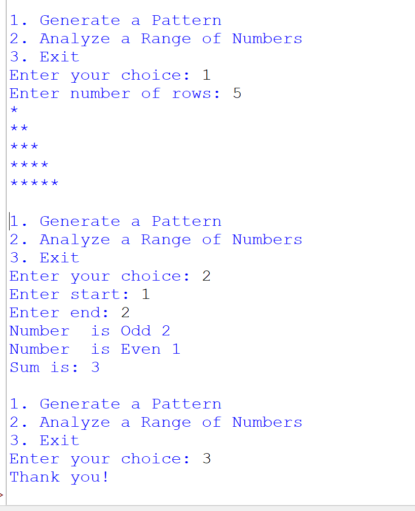

## 📌 Project Overview

This project is a **menu-driven Python console application** that demonstrates the use of:

* Loops (`for`, `while`)
* Conditional statements
* User input handling
* Basic logical operations

## 🛠️ Features

### 🔹 Option 1: Generate a Pattern

* Accepts number of rows from the user
* Prints a right-angled triangle star (`*`) pattern

**Example (Rows = 5):**


*
**
***
****
*****


### 🔹 Option 2: Analyze a Range of Numbers

* Takes a start and end value
* Identifies **odd and even numbers** in the range
* Calculates the **sum of all numbers**

**Example Output:**

```
Number is Odd: 2
Number is Even: 1
Sum is: 3
```

---

### 🔹 Option 3: Exit

* Safely terminates the program with a thank-you message

---

## 🖼️ Program Screenshot

Below is the actual output of the program:



---

## 📚 Concepts Used

* `for` loop
* `while` loop
* `if-else` conditions
* User input (`input()`)
* Menu-driven programming

---

## 👨‍💻 Author

**Dhruv Prajapati**


